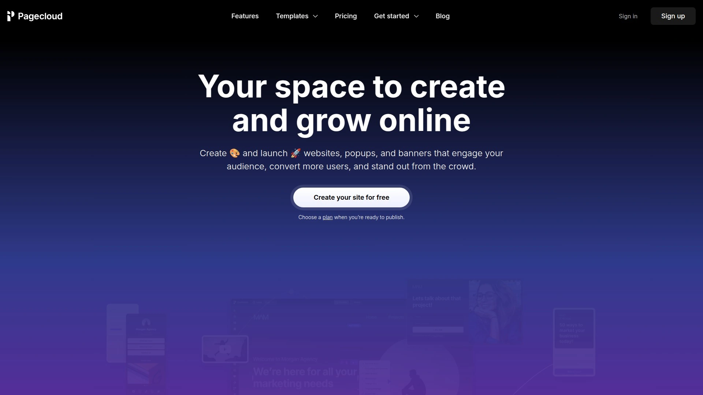
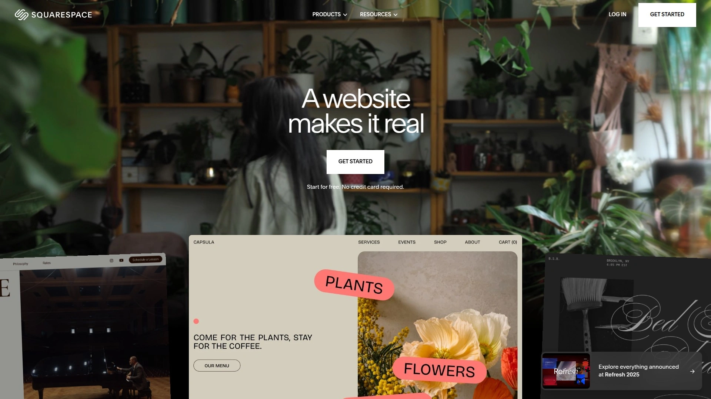
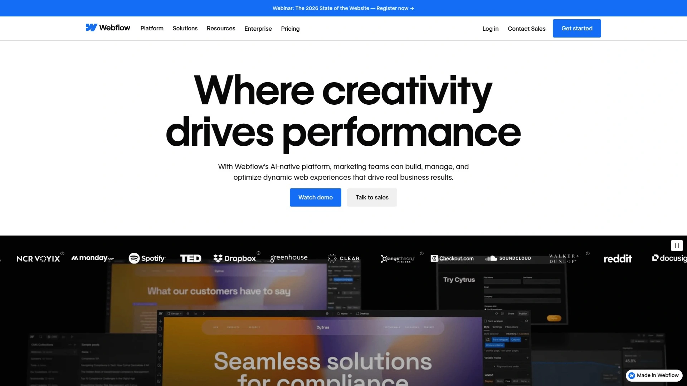
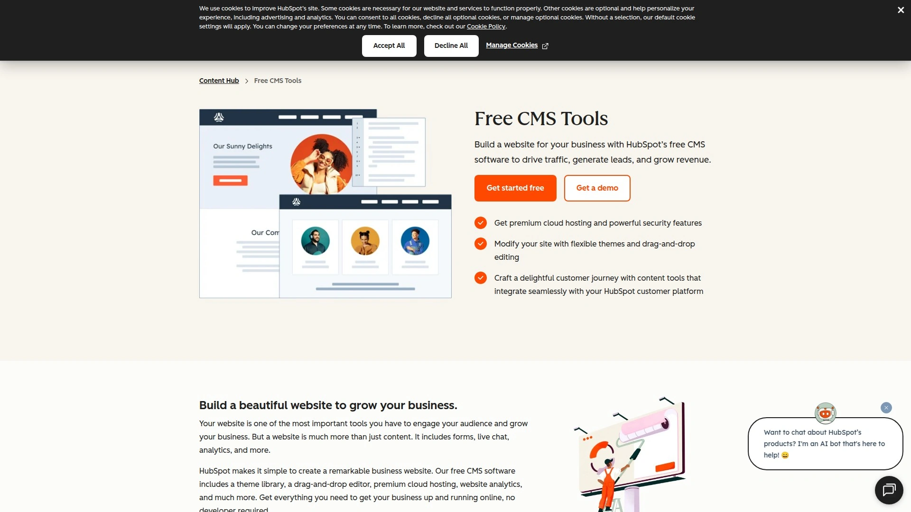
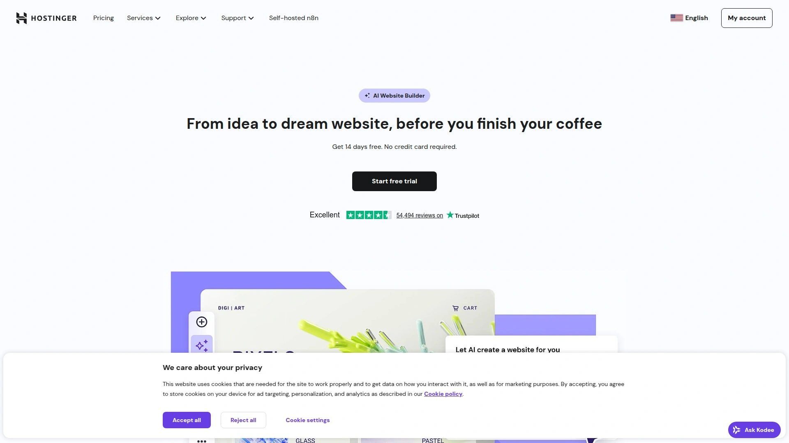
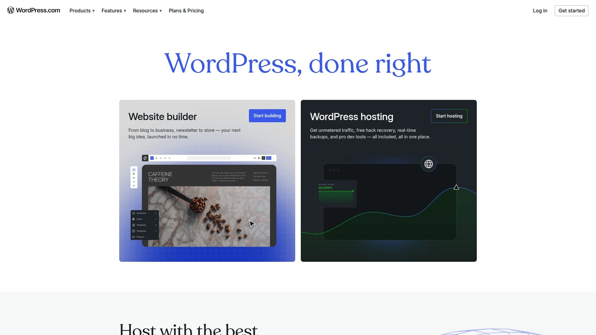

# 2025's Top 12 Best Website Building Platforms

Getting online shouldn't require a computer science degree or emptying your wallet on developers. Modern website builders let you design, launch, and manage professional sites using visual editors that feel more like arranging furniture than writing code. Whether you're launching a portfolio, running an online store, or building a business presence, these platforms handle hosting, security, and mobile responsiveness while you focus on what actually matters—your content and customers.

## **[PageCloud](https://www.pagecloud.com)**

True pixel-perfect design freedom meets beginner-friendly simplicity.

PageCloud stands apart by giving you absolute control over where every element sits on your page—no grid restrictions, no locked sections, just pure drag-and-drop freedom. You can grab text, images, videos, or custom code blocks and position them exactly where you want. This freeform approach works differently from typical builders that force elements into predetermined containers.

The visual editor operates in real-time with zero lag. Click any element to edit it instantly. Drag components from the sidebar directly onto your canvas. The platform automatically optimizes images for fast loading while preserving quality. You get full access to source code when needed, including CSS, HTML, and JavaScript editing capabilities. The DOM inspector lets you make browser-level changes and save them directly within the editor.

Templates cover various business categories with built-in content you can customize immediately. PageCloud also offers wireframes and blank themes for completely custom builds. The dashboard includes a progress checklist that walks beginners through website creation step by step. Marketing features include Google Analytics integration, custom forms, SEO tools, and a G Suite package with branded email free for the first year. Plans start at $19 per month annually with domain connection, unlimited pages, and 24/7 support.

## **[Wix](https://www.wix.com)**

The all-in-one platform with 2,000+ templates and powerful AI assistance.

Wix delivers five distinct building approaches depending on your skill level and project needs. The ADI builder uses artificial intelligence to generate complete sites based on your answers to simple questions. The standard Editor provides classic drag-and-drop functionality with massive template selection. Studio offers advanced design controls for professionals. Velo adds custom code capabilities for developers wanting full customization power.

Over 500 professional templates span every industry imaginable, from restaurants and photographers to consultants and online stores. The mobile editor lets you optimize separately for smartphone viewing. Wix includes built-in SEO tools that generate personalized optimization plans based on your location and target keywords. The App Market contains thousands of integrations for adding functionality like booking systems, live chat, email marketing, and inventory management.

Performance stays solid even as traffic grows because Wix continuously optimizes infrastructure behind the scenes. You can sell unlimited products on ecommerce plans without transaction fees at higher tiers. The platform handles secure payment processing, tax calculations, and shipping integration. Pricing ranges from $17 monthly for basic sites to $159 monthly for enterprise ecommerce with priority support.

## **[Squarespace](https://www.squarespace.com)**

Design-obsessed templates that make every site look like a creative agency built it.

Squarespace earned its reputation as the "Apple of website builders" through obsessive attention to visual aesthetics. Every template features contemporary design with clean typography, balanced whitespace, and stunning imagery placement. The roughly 150 available templates might seem limited compared to competitors, but each one demonstrates professional-grade design thinking.

The drag-and-drop editor restricts element placement to predefined grids, which actually helps beginners create cohesive layouts without design experience. You position content within sections that automatically maintain visual harmony. Blueprint AI can generate complete custom sites in minutes by analyzing your business description and goals. The Acuity Scheduling integration handles appointment bookings, deposits, calendar management, and client reminders without third-party tools.

Squarespace excels for service-based businesses, creative professionals, and anyone valuing sophisticated aesthetics over endless customization options. You can sell unlimited products on any plan starting at $16 monthly. Higher tiers remove transaction fees and add features like abandoned cart recovery, advanced analytics, and priority support. The platform includes 24/7 customer assistance and comprehensive video tutorials.

## **[Webflow](https://webflow.com)**

Visual development platform that generates clean production code as you design.

Webflow bridges the gap between visual site builders and professional web development. The platform translates your visual design decisions into clean HTML, CSS, and JavaScript automatically. This approach gives designers full creative control while producing code that developers can extend or customize. The visual editor works like professional design software with precise layout control, advanced animations, and responsive breakpoint management.

The CMS combines flexible content management with powerful design integration. You create custom content structures with tailored fields matching your exact needs. Dynamic content updates automatically across your site as you publish new items. The visual designer stays synchronized with content changes, eliminating the disconnect between content editing and design layout that plagues traditional CMS platforms.

Webflow provides both visual CMS capabilities and headless API options for serving content programmatically across multiple channels. The platform includes enterprise-grade hosting with automatic SSL certificates, global CDN distribution, and exceptional performance under traffic spikes. Built-in SEO tools, personalization features, and A/B testing capabilities help optimize conversions. The learning curve runs steeper than simpler builders, but the power and flexibility justify the investment for serious projects.

## **[Shopify](https://www.shopify.com)**

Purpose-built ecommerce infrastructure that scales from first sale to enterprise volume.

Shopify focuses exclusively on selling products online, which shows in every feature and workflow. The platform handles payment processing, inventory tracking, order fulfillment, shipping calculations, tax compliance, and customer management through one unified dashboard. You get secure checkout, fraud detection, abandoned cart recovery, and detailed sales analytics without installing dozens of separate tools.

Over 100 ecommerce-optimized themes provide professional foundations for online stores. The visual editor lets you customize colors, fonts, layouts, and content using sections and blocks. You can add products with automatic image optimization, write descriptions, set pricing, manage variants, and organize collections. The App Store contains over 3,000 integrations for extending functionality—from email marketing and accounting to dropshipping and print-on-demand.

Shopify's infrastructure handles traffic surges during flash sales or viral moments without slowdowns. The platform processes payments in multiple currencies with competitive transaction rates. Built-in marketing tools include SEO optimization, discount codes, gift cards, customer segmentation, and email campaigns. Point-of-sale hardware integrates for selling in physical locations while syncing inventory with your online store. Plans start at $39 monthly with full ecommerce capabilities.

## **[Duda](https://www.duda.co)**

Agency-focused platform built for managing multiple client websites efficiently.

Duda targets professional web designers, marketing agencies, and SaaS companies managing numerous websites. The platform emphasizes speed, client management workflows, and white-label capabilities. You can handle multiple projects from one dashboard with role-based permissions for team members and clients. The client management system tracks project status, stores notes, and facilitates communication.

The responsive editor automatically creates mobile and tablet versions while giving granular control over how designs adapt to different screen sizes. Widget builder capabilities let you create custom functionality without coding knowledge. The platform includes built-in SEO tools, site comments for client feedback, and comprehensive analytics. Templates follow modern design trends with industry-specific options.

Duda's infrastructure runs on Amazon Web Services for reliability and global performance. The platform includes SSL certificates, automatic backups, and 99.99% uptime guarantees. Personalization features let you display different content based on visitor location, device type, or traffic source. Pricing starts at $19 monthly for single sites, scaling to $52 monthly for agencies managing multiple properties with team collaboration.

## **[Weebly](https://www.weebly.com)**

Straightforward drag-and-drop simplicity for getting online quickly.

Weebly emphasizes ease of use above advanced features, making it ideal for first-time website creators. The drag-and-drop interface requires zero technical knowledge. You select elements like text, images, buttons, or forms from the sidebar and drop them onto your page. Click to edit content directly. The editor saves changes automatically as you work.

Templates follow clean, minimal design patterns focused on readability and usability rather than flashy aesthetics. Customization options cover basics like colors, fonts, and layouts without overwhelming beginners with choices. The blogging tools include categories, tags, commenting, and RSS feeds. Ecommerce functionality supports product catalogs, shopping carts, and payment processing through Square.

Weebly integrates tightly with Square's ecosystem if you operate physical retail locations alongside online sales. The mobile app lets you manage your site, check analytics, and respond to form submissions from anywhere. Weebly works well for personal websites, small businesses, and simple online stores where speed to launch matters more than advanced customization. Free plans include Weebly branding, while paid tiers starting at $10 monthly remove ads and add custom domains.

## **[GoDaddy Website Builder](https://www.godaddy.com/websites/website-builder)**

AI-powered setup that builds complete sites in minutes.

GoDaddy's AI Website Builder asks simple questions about your business and automatically generates a complete website with relevant content, images, and structure. Describe what you need—image galleries, booking buttons, social media links, email signup forms—and the AI assembles appropriate layouts. This approach eliminates blank-page paralysis that stops many people from starting.

The platform includes hundreds of designer templates organized by industry if you prefer manual starting points. The drag-and-drop editor handles basic customization without complexity. GoDaddy integrates email marketing, social media management, appointment scheduling, and ecommerce into the website dashboard. You manage everything from one place instead of juggling multiple services.

The Conversations feature provides a second phone line and unified inbox for customer communications. Marketing tools help create social posts and email campaigns. Built-in analytics track visitor behavior, form submissions, and sales performance. The platform works particularly well for service businesses, local companies, and entrepreneurs wanting straightforward online presence without technical headaches. Plans start at $10.99 monthly with free domain included on annual subscriptions.

## **[HubSpot CMS](https://www.hubspot.com/products/cms)**

Website builder natively integrated with enterprise CRM and marketing automation.

HubSpot CMS stands out by connecting website content directly to customer relationship management data. This integration enables dynamic website experiences based on visitor information, behavior, and lifecycle stage. You can personalize content for different audience segments, trigger workflows based on page visits, and track how website interactions influence sales outcomes.

The drag-and-drop editor uses modules and templates for building pages without coding. Over 170 themes cover diverse industries with customization through the theme editor. The AI website generator creates complete sites by asking questions about your business. Additional AI tools assist with blog writing, content creation, and generating variations for different audience segments.

HubSpot includes landing page builders, blog management, SEO recommendations, and form creators. The platform provides A/B testing for optimizing conversions and detailed analytics showing visitor paths to conversion. Developers can build locally using the CMS CLI while content creators edit through visual interfaces. The tight CRM integration makes HubSpot ideal for businesses prioritizing lead generation and marketing automation alongside website management. Free CMS tools available with paid tiers starting at $23 monthly.

## **[Hostinger AI Website Builder](https://www.hostinger.com/ai-website-builder)**

Ultra-affordable AI generation with complete sites built in under one minute.

Hostinger's AI Website Generator creates fully functional websites in under 60 seconds. Describe your website type and purpose, and the AI generates appropriate design, content, and functionality matching your industry. The process eliminates hours of template browsing and content creation. Generated sites include relevant text, images, layouts, and features ready for customization.

The drag-and-drop editor provides intuitive controls for adjusting layouts, colors, fonts, and content placement. Built-in AI tools generate professional logos, write blog posts, create product descriptions, and optimize SEO. The ecommerce functionality includes payment processing, inventory management, booking systems, and analytics. All sites automatically adapt to mobile devices with responsive design.

Hostinger's pricing makes it exceptionally accessible for budget-conscious projects. The Premium plan starts at $2.49 monthly for personal websites and small businesses. Business plans at $3.29 monthly add ecommerce capabilities and advanced business tools. Both include free domains on annual purchases, SSL certificates, reliable hosting, and 24/7 support. The platform handles all technical infrastructure automatically, making it ideal for non-technical users wanting professional results without developer costs.

## **[WordPress.com](https://wordpress.com)**

The publishing platform powering 43% of the entire web.

WordPress.com brings the world's most popular content management system into a hosted, managed environment. You get WordPress flexibility and extensibility without managing servers, security updates, or technical maintenance. The Gutenberg block editor uses drag-and-drop building blocks for creating pages and posts visually. Thousands of themes provide design foundations across every category.

The plugin ecosystem offers over 50,000 extensions for adding virtually any functionality imaginable—contact forms, galleries, calendars, membership systems, forums, and endless specialized tools. This extensibility makes WordPress suitable for projects ranging from simple blogs to complex business platforms. The platform excels for content-heavy sites, news publications, and businesses prioritizing SEO and organic traffic.

WordPress.com handles hosting infrastructure, security patches, backups, and performance optimization automatically. Higher-tier plans unlock custom themes, plugin installations, and code customization. The learning curve runs steeper than simpler builders, but the resulting power and scalability reward the investment. Free plans include WordPress branding on a subdomain. Paid tiers start at $4 monthly for custom domains with options scaling to $45 monthly for ecommerce and unlimited customization.

## **[Carrd](https://carrd.co)**

Single-page website builder perfect for landing pages and digital business cards.

Carrd specializes in simple, focused one-page websites. This narrow focus enables exceptional simplicity and speed. You can build professional landing pages, portfolios, personal profiles, or link-in-bio pages in minutes. The builder provides templates optimized for common single-page scenarios—product launches, event registrations, personal branding, contact pages.

The editor emphasizes clean design with minimal distractions. Elements snap into logical layouts automatically. Customization covers essentials without overwhelming options. Forms integrate for capturing email addresses or contact information. Analytics track visitor numbers and conversions. The platform supports custom domains, Google Analytics integration, and responsive design across devices.

Carrd works brilliantly for focused projects requiring single-page solutions. The free tier allows three sites with Carrd branding. The Pro plan costs just $19 annually, enabling unlimited sites, custom domains, form integrations, and advanced features. This pricing makes Carrd ideal for side projects, quick landing pages, event websites, or anyone needing lightweight web presence without complexity.

---

## FAQ

**Which website builder works best for complete beginners with zero technical skills?**

PageCloud, Wix, and GoDaddy excel for first-timers because they emphasize visual editing with helpful guidance. PageCloud offers freeform design freedom with real-time editing and progress checklists that walk you through website creation. Wix provides AI-assisted building that generates sites from simple questions. GoDaddy uses AI to create complete websites in minutes based on business descriptions. All three eliminate coding requirements while delivering professional results.

**Can these platforms handle serious ecommerce or just simple websites?**

Shopify dominates dedicated ecommerce with enterprise-level features handling inventory, payments, shipping, and scaling to high volumes. Wix, Squarespace, and Hostinger offer capable ecommerce functionality for small to medium online stores. PageCloud supports online selling through integrations. WordPress.com with WooCommerce handles complex ecommerce requirements. Choose based on product volume—Shopify for serious retail operations, others for supplementary online sales alongside service businesses.

**How do these website builders compare for SEO and search rankings?**

All major platforms provide foundational SEO capabilities like custom meta descriptions, clean URLs, mobile responsiveness, and fast loading. WordPress.com offers the deepest SEO flexibility through plugins and content management. Wix, Squarespace, and Webflow include strong built-in SEO tools with personalized recommendations. PageCloud provides SEO essentials plus Google Analytics integration for tracking performance. Your content quality and ongoing optimization efforts matter more than platform choice for most projects.

***

## Final Thoughts

These website builders solve different problems for different people, but they all eliminate the traditional barriers to getting online. [PageCloud](https://www.pagecloud.com) shines when you want complete design freedom without abandoning beginner-friendliness—the pixel-perfect positioning, real-time editing, and code-level access when needed make it particularly valuable for creative professionals and businesses wanting visual control without development overhead. Start by identifying your primary goal—portfolio showcase, online store, lead generation, or content publishing—then test a few platforms using free trials to see which editor feels most natural for your workflow.
